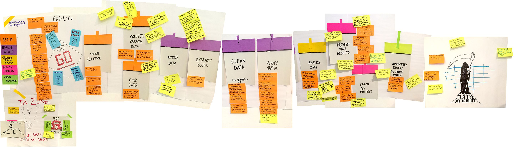

#   DSC 100: Introduction to Data Management

## Description:

Databases are at the heart of modern commercial application development. Their use extends beyond this to many other environments and domains where large amounts of data must be stored for efficient update, retrieval, and analysis. The purpose of this course is to provide a comprehensive introduction to the use of management systems for applications. Some topics covered are the following: data models, query languages, query evaluation and optimisation,  database design and transactions. 

## Instructional team:

**Instructor:**

[Babak Salimi](https://bsalimi.github.io/), bsalimi@ucsd.edu

**Course Assistants:**

[Aditya Lahiri](https://adityalahiri.github.io/), [adlahiri@ucsd.edu](mailto:adlahiri@ucsd.edu) 

[Gaurav Kumar](https://github.com/gaurav5590), [gkumar@ucsd.edu](mailto:gkumar@ucsd.edu)

[Divija Devarla](https://in.linkedin.com/in/divija-devarla-7b8103ab), [ddevarla@ucsd.edu](mailto:ddevarla@ucsd.edu)

**Lectures**:

The lecture for this class will be ASYNCHRONOUS and discussion sections will be SYNCHRONOUS. 

**Discussion:**: 

Wednesdays 4:00 pm to 4:50 pm 

**Office Hours:**

Mondays     2:00pm  to 3:00pm     (Gaurav) 

Tuesdays    1:00pm  to 2:00pm      (Divija)

Thursdays  3:30pm to 4:30pm       (Babak)

Fridays        10:00am to 11:00am   (Aditya)

**Zoom Meetings:** 

Links to the Zoom meetings will appear on the course's Canvas page.

**Piazza:** [https://piazza.com/ucsd/fall2021/dsc100](https://piazza.com/ucsd/fall2021/dsc100) (Requires access code posted on Canvas)

**Have questions? Please email both Babak Salimi (bsalimi@ucsd.edu) and one of the TAs for questions on logistics. All other questions SHOULD be discussed on Piazza.**

## **Calender:**

**(subject to change)**

| Week |           Description           | Discussions | **Assignments / Remarks** | Lectures | **Optional Reading** |
| :--: | :-----------------------------: | :----: | ----- | --------------- | ---- |
|  1   | Intro, Data models, SQL | Sqlite practice [Source](https://drive.google.com/file/d/1hPmCCTVhdDo1vJKnZsJIR04oaWLwvbVw/view?usp=sharing), [Recording](https://drive.google.com/file/d/1bAu5O5ZkWtZtG_9pbExv30p4-y3rPmYj/view?usp=sharing) |       | [Slides and Recordings](Lectures/lec01.md) | Sec. 2.1, 2.2, 2.3 |
|  2   |   Join and Aggregates in SQL    | Basic SQL Practice [Source](https://piazza.com/class/kti1j0n6qv51du?cid=100) [Recording](https://ucsd.zoom.us/rec/play/PxQ_vZ0oEYXuPsSycxJwmE5jPMFu7MwtdUc9T1-hBYejjbcn-qh2lraxrFHTH39PZ7QEzAGkssKy1GJw.bg960idHpaoO1zhY) | WQ1 due: Introduction, Data Models, and Simple SQL   HW1 due: Sqlite | [Slides and Recordings](Lectures/lec02.md) | Sec. 6.1, 6.2 |
|  3   | Advanced SQL | Advanced SQL Practice [Source](https://piazza.com/class/kti1j0n6qv51du?cid=159) [Recording](https://ucsd.zoom.us/rec/play/2-mk2dLJ8NXjr_YktydECyKcKAn12Wxh40qRquG8S1VDPGQf-6k5KN-iNaVCJsVc3UYfjwyctIZKParE.xA0ymYbsUrKrxlIN) | HW2 due: Basic SQL  WQ2 due: SQL Aggregates | [Slides and recordings](./Lectures/lec03.md) |  |
|  4   |  Relational Algebra  | Relational Algebra [Source](https://piazza.com/redirect/s3?bucket=uploads&prefix=paste%2Fkti1ku2x6td1p0%2F903b05e3a1546a1f4b010277c194aa311676d9f18dd44b72115228a660a81439%2FRelational_Algebra.zip) [Recording](https://ucsd.zoom.us/rec/play/yl1KfQPMa21KRUM3Zkamh8JXpkslSgPcS5by9Lcz4BfNG1mbT9NSq_2RR0qT66NrOGNo_HtiqiyCqcLH.UDllfxlH0ltNALws) ,     Troubleshooting PostgreSQL [Recording]([https://ucsd.zoom.us/rec/share/a9yg8DMTlGLBW4AfYDdGBAGgRXXjv4s3bsrfwdxAg9XDWo1mV6VJ69yfkCE_cIKW.BYNBEM4pTD_SOrjt](https://urldefense.proofpoint.com/v2/url?u=https-3A__ucsd.zoom.us_rec_share_a9yg8DMTlGLBW4AfYDdGBAGgRXXjv4s3bsrfwdxAg9XDWo1mV6VJ69yfkCE-5FcIKW.BYNBEM4pTD-5FSOrjt&d=DwQFAg&c=-35OiAkTchMrZOngvJPOeA&r=BMZcSMPm7tho8CPnV6FIMA&m=qbWjlFL6g3EHRc6d9tyOyIEZk_TDY-qUFbK8QZ8wk_4&s=fZjhu_Jks7jvFRsjQn3hw8oxj4NXkTsXK-VswF5YM-8&e=)) |  | [Slides and recordings](./Lectures/lec04.md) |  |
| 5  |        Query Evaluation, Midterm        | Midterm Pratice [Recording](https://ucsd.zoom.us/rec/play/5zvL91v89AjWAW2COicPZW7CatdYYnUzX6Txsr5j8aWbWqsbvoxzBV5nY0cMFaqTD56GecJsy_VgW7FU.rt08h2wj3OqyKXdz) | WQ3 due: SQL Aggregates | [Slides and recordings](./Lectures/lec05.md) |  |
|  6   | Basics of Data Storage and Indexes |  | HW3 due: Advanced SQL | [Slides and recordings](./Lectures/lec06.md) |  |
|  7   |         Cost Estimation,  NoSQL Databases         |  |  | [Slides and recordings](./Lectures/lec07.md) |  |
|  8   | Conceptual Design |  | HW4 due: Relational Algebra | [Slides and recordings](./Lectures/lec08.md) | Sec. 4.1, 4.6 |
|  9  | BCNF, Transactions |  |  |  |  |
| 10 | Advance Topic |  |  |  |  |

*Note:*  The slides are adopted from the UW database group. 

## Workload:

**(subject to change)**

**Homework (60%):** There will be **weekly homeworks**. They will be based on the last 1-2 lectures. They are of two types:

1. **Written problem-solving and programming assignments (50%):**
   Start early and allocate enough time to solve these problems! 
2. **Gradiance exercises (10%):**
   [Gradiance](https://www.gradiance.com/) is an online service pioneered by one of the authors of the textbook, Prof. Jeffrey Ullman at Stanford. One of the best features of Gradiance is that you are permitted to test yourself on a particular topic as many times as you like. You receive immediate feedback for each attempt, which avoids the shortcoming of the traditional submit-and-then-wait-for-grades assignments where one error in understanding can permeate solutions to multiple problems and does not get rectified until much later. We encourage you to continue testing on each topic until you complete the part of the assignment with a 100% score. The highest score will be recorded. The questions will be the same in every attempt, but the answer choices will be selected at random. 
3. **Midterm (20%)** and **final  (20%)**: Details would be posted later.
5. **Extra Credit**: 

   - Some howmeworks have extra credit questions.
   - Large number of good answers/questions on Piazza.  
   - Attandance in the dicussions. 
## Resources / Communication / Toolkits:

**Book:** Although a textbook is not required in the course, the following textbook is optional and recommended. Lecture slides and recorded videos would be sufficient for this class.

Database Systems: The Complete Book, by Hector Garcia-Molina, Jeffrey D. Ullman, and Jennifer Widom. 2nd Edition. Prentice Hall. 2008.

**Canvas:** All weekly homework assignments should be turned in via Canvas.

**Gradescope:** We will use Gradescope for submission and grading of exams.

**Communication and Piazza:**  All important announcements will be sent through both Piazza and Canvas.

All questions that may be of general interest to the class should be directed to Piazza. You will get your questions answered faster on Piazza than via personal emails to the instructional team, because Piazza is monitored closely by everybody in the class, not just the course staff. You are highly encouraged to answer each others' questions on Piazza (*you will get extra credit for # of good answers on Piazza!*) and the instructional team would endorse/add to those answers.

## Related Groups:

- [UCSD Database Group](https://dbucsd.github.io/)

- [SIGMOD (Special Interest Group on Management of Data)](https://www.google.com/url?q=https%3A%2F%2Fsigmod.org%2F&sa=D&sntz=1&usg=AFQjCNEv9sM8CpuOZ7oxWFX_20353W6NZw)

- [VLDB (Very Large Data Base Endowment Inc.)](https://www.google.com/url?q=https%3A%2F%2Fwww.vldb.org%2F&sa=D&sntz=1&usg=AFQjCNEN7a3TJIOhpq3OC7bw9DKWHhki-w)

- [PODS (Symposium on Principles of Database Systems)](https://www.google.com/url?q=https%3A%2F%2Fsigmod.org%2Fpods%2F&sa=D&sntz=1&usg=AFQjCNEy52V8Padws9vrgz2GoFYinNgG9Q)

- [ICDT(IEEE International Conference on Data Engineering)](http://ieee-icde.org/)

- [CIDR (Conference on Innovative Data Systems Research)](http://www.google.com/url?q=http%3A%2F%2Fcidrdb.org%2F&sa=D&sntz=1&usg=AFQjCNHZ5MTU545Lei9xcYfQR9fHHLan5w)